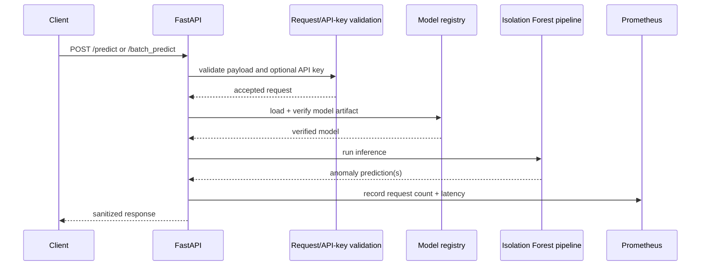

<div align="center">

# Cautious Enigma

### Reproducible anomaly-detection pipeline and observable FastAPI service built around deterministic Isolation Forest inference.

[](https://github.com/CoreyLeath-code/cautious-enigma/actions/workflows/ci.yml)
[](https://github.com/CoreyLeath-code/cautious-enigma/actions/workflows/supply-chain.yml)
[](https://github.com/CoreyLeath-code/cautious-enigma/releases)


[](LICENSE)

</div>

## Executive summary

Cautious Enigma converts security-log-derived features into anomaly scores using an Isolation Forest pipeline and exposes inference through FastAPI. The strongest verified story is **reproducible systems engineering around anomaly detection**: deterministic seeded benchmark fixtures, bounded API inputs, model-registry integrity checks, Prometheus metrics, non-root container execution, Kubernetes deployment controls, CI, vulnerability scanning, SBOM generation, and semantic-tag container publication.

The repository deliberately separates **systems performance evidence** from **predictive quality**. A latency result does not establish threat-detection accuracy, recall, calibration, fairness, or operational safety. Those require a labeled, versioned evaluation dataset and a pre-declared evaluation protocol.

## Verified capability boundaries

**Verified in code/CI:** deterministic benchmark generation, FastAPI health/metrics endpoints, bounded batch requests, optional API-key protection, SHA-256 model artifact verification, non-root container execution, Kubernetes schema checks, Trivy scans, SPDX SBOM generation, and semantic-version GHCR publication.

**Not claimed:** production SLOs, real-world threat-detection efficacy, internet-scale throughput, zero false positives, fairness across environments, or security certification.

## Architecture flowchart

```mermaid
flowchart LR
    L[Security log events] --> P[Preprocessing]
    P --> F[Feature extraction]
    F --> IF[Isolation Forest]
    IF --> A[Anomaly decisions]
    A --> API[FastAPI inference service]
    API --> H[/health /live /ready]
    API --> M[/metrics]
    R[(Model registry)] --> API
    B[Seeded synthetic benchmark] --> IF
    B --> E[Versioned benchmark evidence]
    CI[GitHub Actions] --> T[Tests + coverage + lint]
    CI --> S[Trivy + SBOM]
    CI --> C[Container + Kubernetes validation]
```

## System design flow



## Quick Start

### Linux/macOS

```bash
git clone https://github.com/CoreyLeath-code/cautious-enigma.git
cd cautious-enigma
python -m venv .venv
source .venv/bin/activate
python -m pip install --upgrade pip
python -m pip install -r requirements-dev.txt
pytest
python benchmarks/run_benchmark.py --output artifacts/benchmark.json
uvicorn app.api:app --host 127.0.0.1 --port 8000
```

### Windows PowerShell

```powershell
git clone https://github.com/CoreyLeath-code/cautious-enigma.git
Set-Location cautious-enigma
py -m venv .venv
.\.venv\Scripts\Activate.ps1
python -m pip install --upgrade pip
python -m pip install -r requirements-dev.txt
pytest
python benchmarks/run_benchmark.py --output artifacts/benchmark.json
uvicorn app.api:app --host 127.0.0.1 --port 8000
```

Check the service:

```bash
curl http://127.0.0.1:8000/health
curl http://127.0.0.1:8000/metrics
```

Prediction routes can be protected by setting `CAUTIOUS_API_KEY` and sending it in the `x-api-key` header.

## API contract

| Endpoint | Purpose |
|---|---|
| `GET /health` | basic health signal |
| `GET /live` | liveness signal |
| `GET /ready` | readiness signal |
| `GET /metrics` | Prometheus exposition |
| `POST /predict` | single inference request |
| `POST /batch_predict` | bounded inline batch inference, max 1,000 records |

The API rejects unknown request fields through Pydantic models, does not accept server-side file paths from HTTP clients, and sanitizes unexpected model failures into HTTP 503 responses.

## Evidence and reproducibility

| Evidence | Current mechanism | What it proves | What it does not prove |
|---|---|---|---|
| Correctness | `pytest` + coverage artifact | tested contracts pass on CI | absence of all defects |
| Static quality | Ruff + Bandit | selected code-quality/security checks pass | formal security assurance |
| Dependency health | `pip-audit` | declared runtime dependencies have no audit-blocking result in that run | future CVE absence |
| Benchmark | seeded synthetic fixture + JSON artifact | repeatable computational behavior for fixed parameters | real-world detection quality |
| Container | build + UID check + health probe | image builds and runs as UID 10001 | production reliability |
| Kubernetes | Kubeconform + hardening assertions | manifests satisfy selected schema/hardening controls | cluster-level operational safety |
| Supply chain | Trivy + SPDX SBOM | automated scan and dependency inventory evidence | complete vulnerability absence |

For a result to be reproducible, record the commit SHA, Python/dependency versions, OS/platform, benchmark seed, row count, estimator count, contamination, warm-up count, timed iterations, dataset SHA-256, and generated timestamp.

## Research-style benchmark protocol

The checked-in benchmark harness is designed for **systems measurement**, not model-quality validation. CI uses a small reproducible run; larger local experiments should increase iterations and preserve the same metadata fields.

```bash
python benchmarks/run_benchmark.py \
  --rows 1000 \
  --iterations 5 \
  --warmup 1 \
  --output artifacts/benchmark.json
```

Every published benchmark should report at least median, p95, p99, min/max latency, throughput, anomaly count, environment metadata, seed/configuration, and dataset hash. Comparisons are only meaningful when parameter blocks and environments are compatible.

### Reference benchmark currently documented

The repository currently documents a Windows 11 / Python 3.12.13 reference run generated on 2026-07-17 using seed 42, 1,000 rows, 100 estimators, contamination 0.1, one warm-up, and five timed iterations. The documented median batch latency is 4.620 ms, p95/p99 is 4.824 ms, and derived throughput is 216,440.85 rows/s. Treat this as one-machine descriptive evidence, not a production SLO or predictive-quality result.

## Model-quality evaluation contract

Before this repository makes claims such as recall, precision, F1, AUROC, false-positive rate, or detection efficacy, require:

1. a versioned labeled dataset or immutable manifest with provenance;
2. train/validation/test separation with leakage controls;
3. declared preprocessing and feature-generation versions;
4. fixed seeds or a declared repeated-evaluation design;
5. baseline comparisons;
6. precision/recall/F1 and PR-AUC with confidence intervals where appropriate;
7. false-positive analysis by traffic/log cohort;
8. threshold-selection methodology declared before test evaluation;
9. drift/OOD analysis;
10. model artifact hash and model card tied to the evaluated commit.

## Container and deployment

```bash
docker build -t cautious-enigma:local .
docker run --rm -p 8000:8000 cautious-enigma:local
```

The image runs as UID `10001` and exposes a health check. CI also validates Kubernetes manifests for non-root execution, a read-only root filesystem, dropped Linux capabilities, disabled service-account token mounting, startup/liveness/readiness probes, and immutable deployment image references.

## Release and package flow

Semantic tags matching `v*.*.*` trigger supply-chain validation and GHCR publication. Release hardening in this repository also creates a GitHub Release source archive with a SHA-256 checksum. The intended package identity is:

```text
ghcr.io/coreyleath-code/cautious-enigma:<version>
```

The GHCR image should carry OCI source/revision/version labels so the package can be traced back to this repository and commit.

## Extended Q&A

**Why Isolation Forest?**  
It provides a practical unsupervised baseline for anomaly scoring when labels are limited, while keeping the project focused on reproducibility, serving, observability, and delivery controls.

**Does a fast benchmark mean the detector is accurate?**  
No. Latency and throughput measure computation. Detection quality requires labeled evaluation data and a separate protocol.

**Why keep synthetic benchmark data?**  
Synthetic seeded fixtures make regression checks reproducible and avoid treating private or sensitive logs as test assets.

**What happens if a model artifact is missing or invalid?**  
The serving path is designed to fail safely with validated/sanitized errors rather than deserialize an unverified artifact.

**Is the API authenticated?**  
It supports an operator-configured API key through `CAUTIOUS_API_KEY`. If no key is configured, prediction routes are not protected by that mechanism.

**Is this production-ready?**  
It is production-shaped and has meaningful engineering controls, but the repository should not claim full production authorization without load evidence, operational SLOs, deployment/rollback evidence, incident procedures, and representative model-quality validation.

## Engineering roadmap

### Phase 1 — Evidence integrity
- keep all badges on `main` and tied to real workflows;
- publish machine-readable benchmark artifacts for every promoted commit;
- add release checksums and immutable image digests.

### Phase 2 — Model evaluation
- add a versioned labeled benchmark dataset or manifest;
- implement leakage-safe evaluation and baseline comparison;
- publish precision/recall/PR-AUC and cohort-level false-positive analysis.

### Phase 3 — Runtime reliability
- add a repeatable load harness with p50/p95/p99, throughput, error rate, CPU and memory;
- verify graceful shutdown, readiness behavior, rollback, and failure injection;
- define explicit SLO candidates only after collecting evidence.

### Phase 4 — Supply-chain hardening
- pin critical actions by immutable commit SHA where practical;
- preserve SPDX SBOM and vulnerability scan evidence per release;
- publish signed image digests and verify signatures in deployment automation.

### Phase 5 — Operations
- add structured logging with sensitive-field controls;
- document alert thresholds, runbooks, incident response and rollback ownership;
- validate Kubernetes behavior in an ephemeral cluster, not only schema/static checks.

## Responsible use

Isolation Forest outputs are anomaly-review signals, not proof of malicious activity. Keep human review in the decision loop, protect log data, monitor false positives and drift, and validate on representative labeled data before using predictions for enforcement.

## License

MIT. See [LICENSE](LICENSE).
